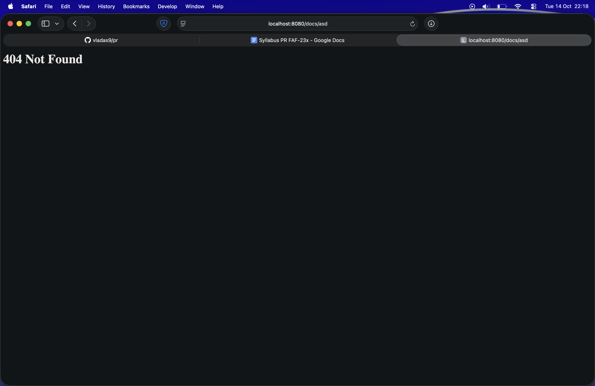
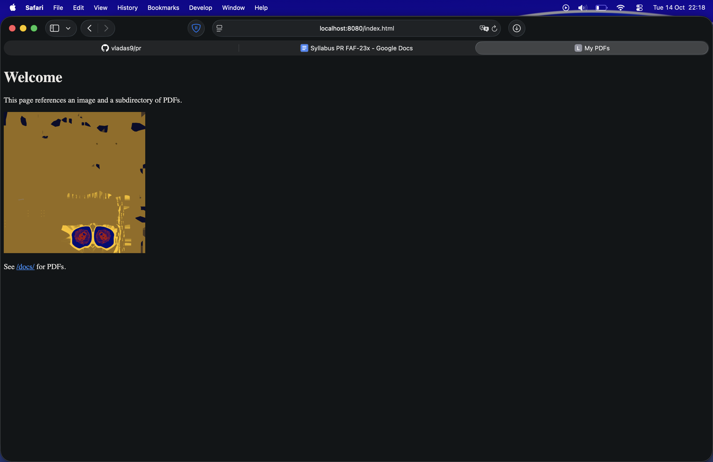
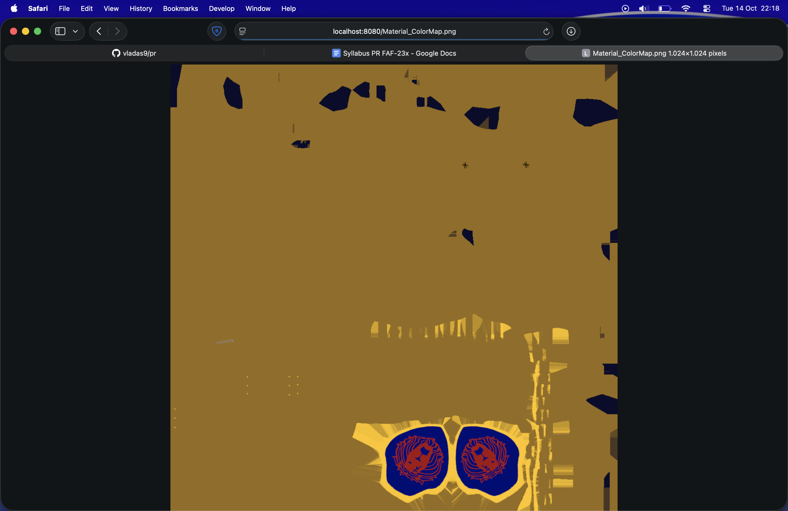
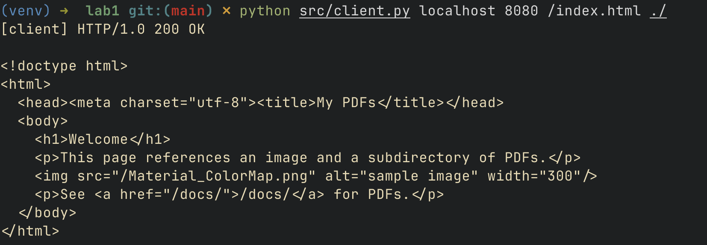
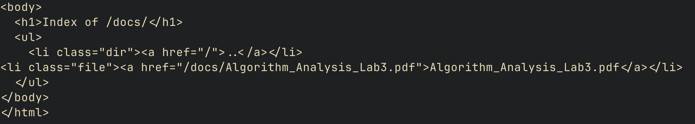

# Lab 1 – HTTP File Server

Name: Vladislav Amza
Group: 221P

## 1. Source Directory Contents
```
lab1/
├─ src/
│  ├─ server.py
│  ├─ client.py
│  ├─ http_utils.py
│  └─ templates/
│     └─ dir_listing.html
├─ content/
│  ├─ index.html
│  ├─ image.png
│  ├─ docs/
│  │  └─ document.pdf
├─ Dockerfile
├─ docker-compose.yml
├─ .gitignore
└─ README.md
```

## 2. Docker Compose File and Dockerfile
`docker-compose.yml`

```yaml
version: "3.8"
services:
  http-server:
    build: .
    container_name: http-server
    ports:
      - "8080:8080"
    volumes:
      - ./content:/srv/site:ro
    restart: unless-stopped
```

`Dockerfile`

```dockerfile
FROM python:3.12-slim

WORKDIR /app

COPY src/ /app/


EXPOSE 8080

CMD ["python", "server.py", "/srv/site"]
```

## 3. Starting the Container

```bash
docker-compose up --build -d
```

## 4. Command That Runs Inside the Container

```bash
python server.py /srv/site
```

## 5. Contents of the Served Directory

```
content/
├─ index.html
├─ image.png
└─ docs/
   └─ document.pdf
```


## 6. Browser Requests

### Inexistent file → 404
`http://localhost:8080/<any non existing path>`



### HTML file with image
`http://localhost:8080/index.html`



### PDF file

`http://localhost:8080/docs/document.pdf`


### PNG file

`http://localhost:8080/image.png`



## 7. Client Usage

### Example 1  Fetch index page:
```bash
python src/client.py localhost 8080 /index.html ./
```



### Example 2 Download PNG:
```bash
python src/client.py localhost 8080 /image.png ~/Downloads/
```
Output:
```
[client] saved PNG -> ~/Downloads/image.png
```

> Works with any supported file type

### 8. Directory Listing (Subdirectory)

`http://localhost:8080/docs/`




