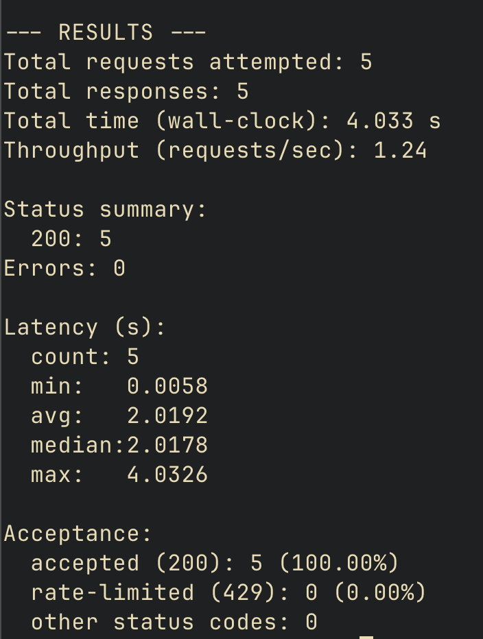
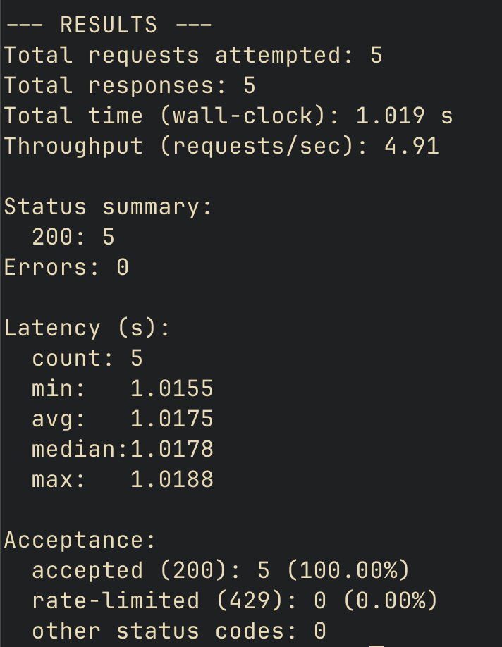
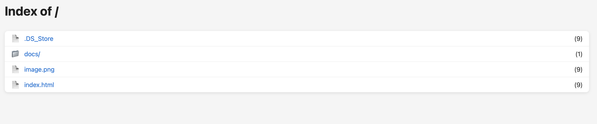
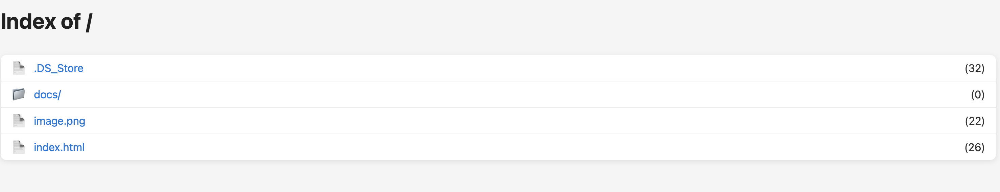
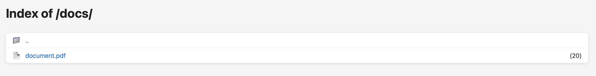

# **Lab 2 — Multithreaded HTTP Server, Counters and Rate Limiting**

## **Task Description**

In this lab, the goal was to upgrade the basic HTTP server from Lab 1 into a **multithreaded** and **thread-safe** version capable of handling multiple concurrent clients.  
Additional requirements included implementing a **request counter** and **per-IP rate limiting**.

---

### **1️ Multithreading**

- The server now creates a **new thread for each connection**, using the `threading` module.
- Each thread executes `handle()` independently, allowing multiple requests to be processed simultaneously.
- A 1-second simulated workload (`time.sleep(1)`) helps measure concurrency.
- A Python test script (`test_requests.py`) launches concurrent requests and measures total handling time.

#### **Expected Behavior**

|Version|Requests|Simulated Delay|Total Time Observed|
|---|---|---|---|
|Single-threaded (Lab 1)|5 requests × 1 s|sequential|≈ 4 s|
|Multithreaded (Lab 2)|5 requests × 1 s|concurrent|≈ 1 s|

---

### **2️ Request Counter**

- Implemented a global `defaultdict(int)` to track the number of requests for every file and directory.    
- Added counters beside items in the HTML directory listing:
    `<li class="file"><a href="file.txt">file.txt</a> (3)</li> <li class="dir"><a href="images/">images/</a> (1)</li>`
- Initially built a naive version without locking → produced inconsistent results under load → demonstrated a **race condition**.
- Introduced `threading.Lock()` to protect counter updates, removing the race condition.   
- Added consistent path normalization so both `/dir` and `/dir/` are counted together.

For 100 request
##### With no lock

##### With lock

#### **Observation**
After synchronization, counters increased correctly for both files and directories.  

---

### **3️ Rate Limiting**

- Implemented **per-IP rate limiting** (≈ 5 requests per second).
- Used `defaultdict(lambda: deque(maxlen=5))` to track timestamps of recent requests per client IP.
- Protected with `rate_lock` to ensure thread-safe access.
- If the limit is exceeded, the server returns: `HTTP 429 Too Many Requests`.
- 
#### **Testing**
Two clients simulated:
1. **Normal user** → under 5 req/s → all `200 OK`
2. **Spammer** → > 5 req/s → some `429 Too Many Requests`

---

## **Implementation Details**
- **Concurrency:** Thread-per-connection model.
- **Synchronization:** Locks around shared data structures (`request_counts`, `rate_limit`).
- **Testing Tools:** Custom `test_requests.py` that sends random requests to files in `lab2/content`.
- **Metrics collected:** Status codes, latencies, total time, acceptance ratio.

---

## **Conclusion**

The multithreaded server now:
- Handles multiple clients simultaneously.    
- Accurately tracks requests per file and directory with thread-safe counters.
- Applies rate limits to prevent overload and spam.
All tasks for Lab 2 were implemented successfully and verified through load testing and visual inspection.

---
