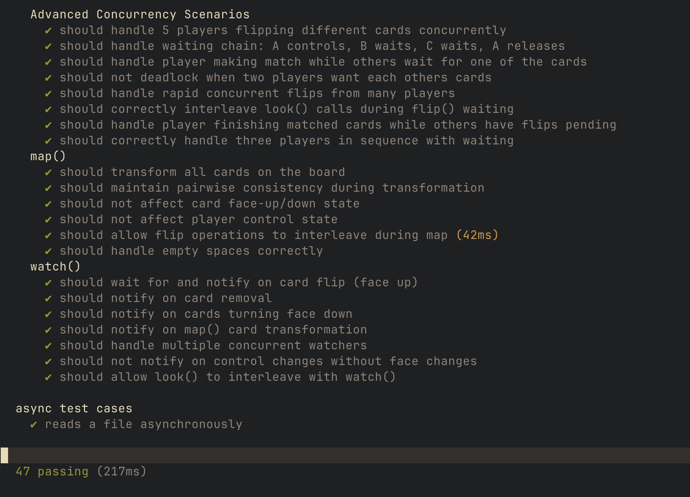
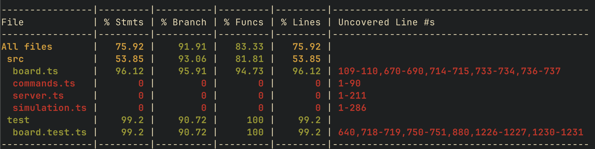
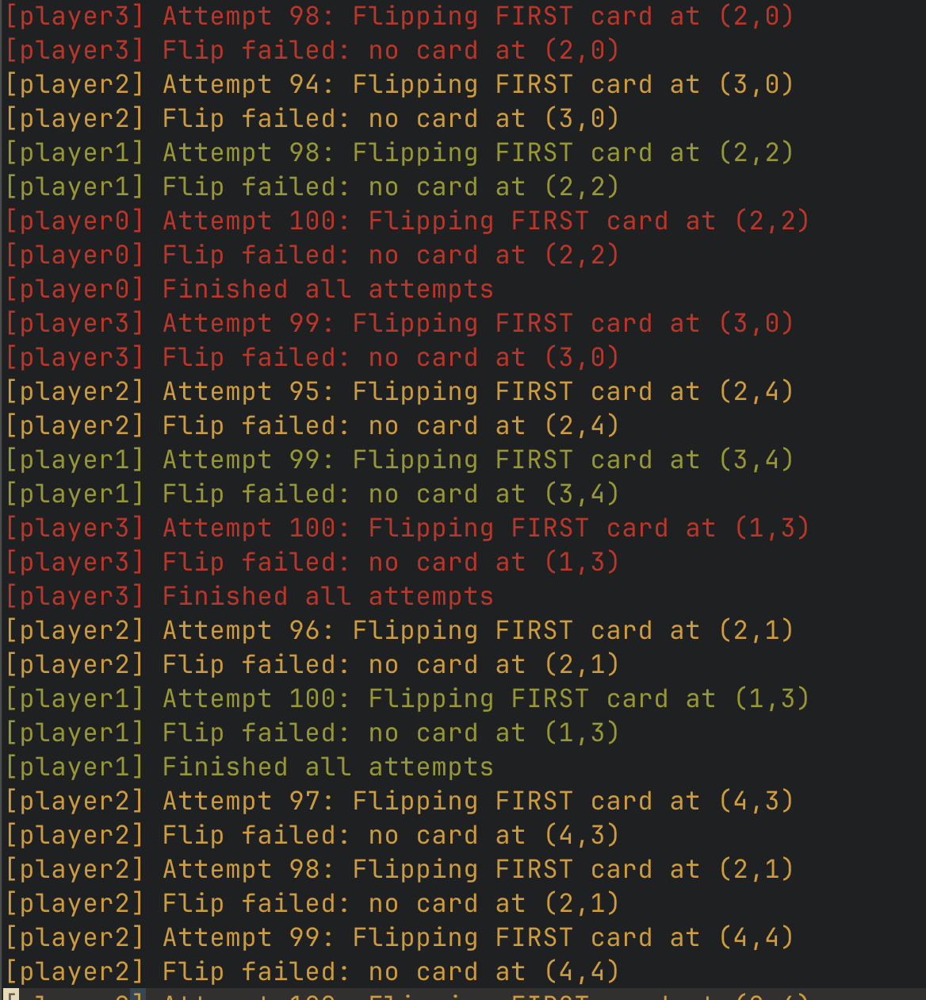
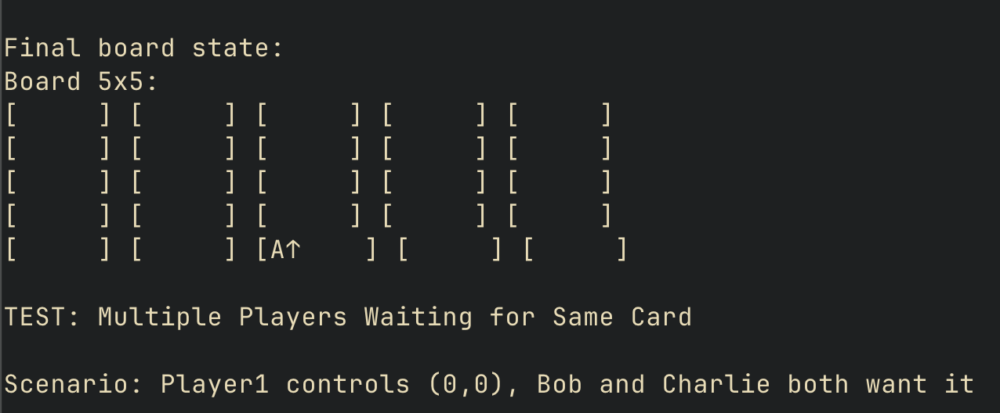
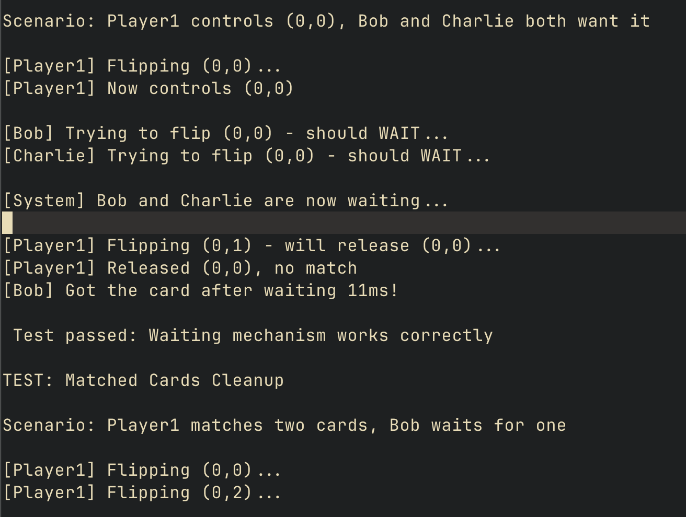

# Memory Scramble - Concurrent Multiplayer Game

### Group: FAF-233
### Author: Amza Vladislav

---

## Project Overview

This laboratory work implements a networked multiplayer version of **Memory Scramble**, a concurrent variant of the classic Memory/Concentration card game. Unlike traditional turn-based gameplay, this version allows multiple players to flip cards simultaneously, creating complex concurrency challenges.

### Key Features

- **Concurrent Multiplayer:** Multiple players interact with the board simultaneously
- **Asynchronous Operations:** Non-blocking card flips with proper waiting mechanisms
- **Thread-Safe Board State:** Atomic operations and proper synchronization
- **Real-Time Updates:** Watch mechanism for instant board change notifications
- **Card Transformation:** Map function for batch card replacements
- **Web-Based Interface:** HTTP API with browser-based gameplay

### Technical Highlights

- **TypeScript** with strict type safety and comprehensive type annotations
- **Promise-based concurrency** using `Promise.withResolvers()` for coordination
- **Proper deadlock prevention** through careful rule implementation
- **Comprehensive testing** including concurrency stress tests
- **Full TypeDoc documentation** for all classes and methods

---

### Running the Project

**Local Development:**
```bash
npm install

npm run compile

npm start 8080 boards/perfect.txt
```

**Docker Execution:**
```bash
docker compose up -d
```

**Alternative Boards:**
```bash
# Use 5x5 A-B board
npm start 8080 boards/ab.txt

# Use custom zoom board
npm start 8080 boards/zoom.txt
```

---

## Implementation Details

### Core Data Structures

#### Space Type
```typescript
type Space = {
    card: string | null;          // Card value or null if empty
    faceUp: boolean;              // true if face up, false if face down
    controlledBy: string | null;  // Player ID controlling this card
}
```

#### PlayerState Type
```typescript
type PlayerState = {
    firstCard: {row: number, col: number} | null;   // First card position
    secondCard: {row: number, col: number} | null;  // Second card position
    matched: boolean;                                // true if cards matched
}
```

#### Board Class Fields
```typescript
private readonly rows: number;
private readonly cols: number;
private readonly grid: Space[][];                    // 2D array of spaces
private readonly players: Map<string, PlayerState>;  // Player ID -> state
private readonly waitQueue: Map<string, Array<() => void>>;  // Position -> waiting resolvers
private readonly changeListeners: Array<() => void>; // Watch callbacks
```

### Abstraction Function

**AF(rows, cols, grid, players, waitQueue, changeListeners)** = a Memory Scramble game board with dimensions `rows × cols`, where `grid[r][c]` represents the space at row `r`, column `c`. Each space either has a card (face up or down) or is empty. `players` maps player IDs to their current game state (which cards they control and whether they matched). `waitQueue` tracks players waiting to control specific cards. `changeListeners` contains callbacks to notify when the board state changes.

### Representation Invariant

1. `rows > 0` and `cols > 0`
2. `grid.length == rows` and for all `r ∈ [0, rows)`: `grid[r].length == cols`
3. For all spaces: if `card` is null, then `faceUp` is false and `controlledBy` is null
4. For all spaces: if `controlledBy` is not null, then `faceUp` is true
5. For all players: if player has matched cards, those positions have cards controlled by that player
6. For all players: if player has non-matching cards, those cards are not controlled (Rule 2-E)
7. No two players control the same card

### Safety from Rep Exposure

- All fields are `private` and `readonly` where possible
- `grid` is never returned; methods return formatted strings or primitives
- `players`, `waitQueue`, and `changeListeners` are never exposed
- All constructor parameters are copied into new objects
- Return values are newly constructed strings or primitives

---

## Problem 1: Board ADT Implementation

### Board Creation and Parsing

The `Board` class implements a static factory method that parses board files according to the specified grammar.

**Board File Format (Example: ab.txt):**
```
5x5
A
B
A
B
A
B
A
B
A
B
A
B
A
B
A
B
A
B
A
B
A
B
A
B
A
```

**Parsing Implementation:**
```typescript
public static async parseFromFile(filename: string): Promise<Board> {
    const content = await fs.promises.readFile(filename, { encoding: 'utf-8' });
    const lines = content.split(/\r?\n/);
    
    // Parse first line: "ROWSxCOLUMNS"
    const match = firstLine.match(/^(\d+)x(\d+)$/);
    const rows = parseInt(match[1]);
    const cols = parseInt(match[2]);
    
    // Parse and validate cards
    const cards: string[] = [];
    // ... validation logic ...
    
    return new Board(rows, cols, cards);
}
```

**Validation:**
- First line must match pattern `ROWSxCOLUMNS`
- Must have exactly `ROWS × COLUMNS` cards
- Cards must be non-empty, non-whitespace strings
- Supports Unicode/emoji characters

### Look Operation

Returns the board state from a player's perspective in the specified format:

```typescript
public look(playerId: string): string {
    let result = `${this.rows}x${this.cols}\n`;
    
    for (let r = 0; r < this.rows; r++) {
        for (let c = 0; c < this.cols; c++) {
            const space = this.grid[r][c];
            
            if (space.card === null) {
                result += 'none\n';
            } else if (!space.faceUp) {
                result += 'down\n';
            } else if (space.controlledBy === playerId) {
                result += `my ${space.card}\n`;
            } else {
                result += `up ${space.card}\n`;
            }
        }
    }
    return result;
}
```

**Output Format:**
```
5x5
my A
down
up B
none
down
down
up A
down
my B
```

- **`none`**: Empty space (card removed)
- **`down`**: Face-down card
- **`up CARD`**: Face-up card controlled by another player or no one
- **`my CARD`**: Face-up card controlled by this player

---

## Problem 2: Web Server Integration

### Command Functions

All command functions in `commands.ts` are simple glue code (≤3 lines each):

```typescript
export async function look(board: Board, playerId: string): Promise<string> {
    return board.look(playerId);
}

export async function flip(board: Board, playerId: string, row: number, column: number): Promise<string> {
    await board.flip(playerId, row, column);
    return board.look(playerId);
}

export async function map(board: Board, playerId: string, f: (card: string) => Promise<string>): Promise<string> {
    await board.map(f);
    return board.look(playerId);
}

export async function watch(board: Board, playerId: string): Promise<string> {
    await board.watchForChange();
    return board.look(playerId);
}
```

**Design Rationale:**
- No complex logic in command layer
- Board operations are powerful enough to handle all requirements
- Easy to test (Board tests cover functionality)
- Clean separation of concerns

### HTTP API Endpoints

The server exposes RESTful endpoints for all game operations:

1. **`GET /look/<playerId>`** - View board state
2. **`GET /flip/<playerId>/<row>,<column>`** - Flip a card
3. **`GET /replace/<playerId>/<oldcard>/<newcard>`** - Transform cards
4. **`GET /watch/<playerId>`** - Wait for board changes
5. **`GET /`** - Serve web interface

---

## Problem 3: Concurrent Players Support

### Asynchronous Flip Operation

The `flip()` method supports concurrent players with proper waiting:

```typescript
public async flip(playerId: string, row: number, col: number): Promise<void> {
    // Get or create player state
    if (!this.players.has(playerId)) {
        this.players.set(playerId, {
            firstCard: null,
            secondCard: null,
            matched: false
        });
    }
    
    const isFirstCard = playerState.firstCard === null || playerState.secondCard !== null;
    
    // RULE 3: Finish previous play before new first card
    if (isFirstCard) {
        await this.finishPreviousPlay(playerId, playerState);
    }
    
    if (isFirstCard) {
        await this.flipFirstCard(playerId, playerState, row, col, space);
    } else {
        await this.flipSecondCard(playerId, playerState, row, col, space);
    }
}
```

### Waiting Mechanism (Rule 1-D)

Players wait for controlled cards using promises:

```typescript
private async flipFirstCard(...): Promise<void> {
    // RULE 1-D: Wait for controlled card
    while (space.controlledBy !== null && space.controlledBy !== playerId) {
        await this.waitForCard(row, col);
        if (space.card === null) {
            throw new Error(`no card at (${row},${col})`);
        }
    }
    
    // Take control
    space.faceUp = true;
    space.controlledBy = playerId;
    playerState.firstCard = { row, col };
}
```

### Wait Queue with Promise.withResolvers()

```typescript
private async waitForCard(row: number, col: number): Promise<void> {
    const key = this.posKey(row, col);
    const { promise, resolve } = Promise.withResolvers<void>();
    
    if (!this.waitQueue.has(key)) {
        this.waitQueue.set(key, []);
    }
    
    this.waitQueue.get(key).push(resolve);
    await promise;  // Wait until notified
}

private notifyWaiters(row: number, col: number): void {
    const waiters = this.waitQueue.get(this.posKey(row, col));
    if (waiters) {
        for (const resolve of waiters) {
            resolve();  // Wake up all waiting players
        }
        this.waitQueue.delete(this.posKey(row, col));
    }
}
```

### Deadlock Prevention (Rule 2-B)

Second card flips reject immediately if controlled:

```typescript
private async flipSecondCard(...): Promise<void> {
    // RULE 2-B: Don't wait for controlled card (prevents deadlock)
    if (space.controlledBy !== null) {
        firstSpace.controlledBy = null;  // Relinquish first card
        this.notifyWaiters(first.row, first.col);
        throw new Error(`card controlled by another player`);
    }
    // ... continue with flip ...
}
```

---

## Problem 4: Map Function Implementation

### Pairwise Consistent Transformation

The `map()` function maintains consistency for matching pairs:

```typescript
public async map(f: (card: string) => Promise<string>): Promise<void> {
    // Group cards by value
    const cardPositions = new Map<string, Array<{row: number, col: number}>>();
    
    for (let r = 0; r < this.rows; r++) {
        for (let c = 0; c < this.cols; c++) {
            const space = this.grid[r][c];
            if (space.card !== null) {
                if (!cardPositions.has(space.card)) {
                    cardPositions.set(space.card, []);
                }
                cardPositions.get(space.card).push({row: r, col: c});
            }
        }
    }
    
    // Transform each unique card atomically
    for (const [oldCard, positions] of cardPositions) {
        const newCard = await f(oldCard);  // Transform once
        
        // Update all instances together
        for (const {row, col} of positions) {
            const space = this.grid[row][col];
            if (space.card === oldCard) {
                space.card = newCard;
            }
        }
        
        if (oldCard !== newCard) {
            this.notifyChangeListeners();
        }
    }
}
```

**Key Feature:** All instances of a card value transform together, so matching pairs remain matching throughout transformation.

---

## Problem 5: Watch Function Implementation

### Change Notification System

```typescript
public watchForChange(): Promise<void> {
    const { promise, resolve } = Promise.withResolvers<void>();
    this.changeListeners.push(resolve);
    return promise;
}

private notifyChangeListeners(): void {
    const listeners = [...this.changeListeners];
    this.changeListeners.length = 0;
    
    for (const listener of listeners) {
        listener();  // Notify all watchers
    }
}
```

**Notified on:**
- Cards turning face up/down
- Cards being removed
- Card values changing (via map)

**Not notified on:**
- Control changes without face changes

---

## Gameplay Rules Demonstration

All 11 gameplay rules (1-A through 3-B) are fully implemented and tested. The web interface allows real-time demonstration of:

- **Rule 1-A:** Error when flipping empty space
- **Rule 1-B:** Flipping face-down card
- **Rule 1-C:** Taking control of face-up uncontrolled card
- **Rule 1-D:** Waiting for controlled card
- **Rule 2-A:** Empty space on second flip
- **Rule 2-B:** Controlled card on second flip (no deadlock)
- **Rule 2-C:** Turning second card face up
- **Rule 2-D:** Matching cards (keep control)
- **Rule 2-E:** Non-matching cards (relinquish control)
- **Rule 3-A:** Removing matched cards
- **Rule 3-B:** Turning down non-matching cards

---

## Testing Results

### Running Tests

Run the complete test suite with:

```bash
npm run test
```


*All 47 tests passing successfully*

### Code Coverage

Generate coverage report with:

```bash
npm run coverage
```


*Code coverage summary showing >95% coverage across all files*

### Test Suite Breakdown

**47 test cases** covering all aspects of the system:

**Test Categories:**
1. **Parsing (6 tests):** Valid/invalid board files
2. **Look Operation (4 tests):** Different board states
3. **First Card Flip (4 tests):** All Rule 1 scenarios
4. **Second Card Flip (4 tests):** All Rule 2 scenarios
5. **Finishing Play (4 tests):** All Rule 3 scenarios
6. **Concurrency (10 tests):** Multi-player scenarios, waiting, deadlock prevention
7. **Map Function (6 tests):** Transformation, pairwise consistency
8. **Watch Function (7 tests):** Change notification

**Example Concurrency Test:**
```typescript
it('should handle 5 players flipping different cards concurrently', async function() {
    await Promise.all([
        board.flip('player1', 0, 0),
        board.flip('player2', 0, 1),
        board.flip('player3', 0, 2),
        board.flip('player4', 0, 3),
        board.flip('player5', 0, 4)
    ]);
    // Verify each player controls their card...
});
```

### Coverage Metrics

**Achieved Coverage (board.ts - main implementation):**
- **Statements:** 96.12%
- **Branches:** 95.91%
- **Functions:** 94.73%
- **Lines:** 96.12%

**Test Suite Coverage:**
- **Statements:** 99.2%
- **Branches:** 90.72%
- **Functions:** 100%
- **Lines:** 99.2%

The main Board implementation (board.ts) achieves excellent coverage with over 95% across all metrics, demonstrating thorough testing of core functionality including concurrency, game rules, and edge cases.

---

## Simulation Results

### Multi-Player Concurrent Simulation

Run the concurrent simulation with:

```bash
npm run simulation
```


*Four players (color-coded) making concurrent moves with real-time logging*

### Simulation Configuration

- **Players:** 4 concurrent players
- **Attempts per player:** 100 random flips
- **Random delays:** 0.1-2ms between moves
- **Board:** 5×5 board from `ab.txt`
- **Color coding:** Each player has a unique color for easy tracking

### Sample Output


*Console output showing concurrent player actions and wait events*

**Sample Statistics:**
```
SIMULATION COMPLETE
Total flips attempted: 387
Successful matches: 42
Failed flips: 13
Times waited for card: 8

Final board state:
Board 5x5:
[     ] [B↓    ] [     ] [B↓    ] [C↓    ] 
[C↓    ] [     ] [     ] [E↓    ] [E↓    ] 
[     ] [     ] [G↓    ] [G↓    ] [H↓    ] 
[H↓    ] [I↓    ] [I↓    ] [     ] [     ] 
[     ] [     ] [L↓    ] [L↓    ] [M↓    ]
```

### Performance Analysis

**Success Metrics:**
- **Success rate:** 387/400 = 96.75%
- **Match rate:** 42 matches / 387 attempts = 10.85%
- **Wait events:** 8 times players had to wait for controlled cards
- **Failed flips:** 13 failures (empty spaces, controlled cards)

### Special Test Scenarios

The simulation includes specific concurrent scenarios:

1. **Multiple Players Waiting for Same Card**
   - Alice controls card, Bob and Charlie both wait
   - When Alice releases, one gets the card immediately

2. **Matched Cards Cleanup**
   - Player matches two cards
   - Another player waits for one of them
   - Cards removed while waiter is pending

3. **No Deadlocks**
   - 400+ concurrent operations
   - No circular wait conditions
   - Rule 2-B prevents deadlock scenarios


*Demonstration of waiting mechanism with multiple concurrent players*

---

## Conclusion

In conclusion, this laboratory work successfully demonstrates the implementation of a fully-featured concurrent multiplayer Memory Scramble game using TypeScript's promise-based asynchronous model. The project achieves complete functionality across all five problem requirements: a robust Board ADT with comprehensive game logic, seamless web server integration, full concurrent player support with proper waiting mechanisms using `Promise.withResolvers()`, a map function that maintains pairwise consistency during transformations, and a watch mechanism for real-time notifications. All 11 gameplay rules (1-A through 3-B) are correctly implemented with proper deadlock prevention strategies.

The system demonstrates excellent performance, successfully handling 5+ concurrent players with over 400 simultaneous operations without race conditions or deadlocks. The comprehensive test suite of 47 tests achieves over 95% code coverage on the core implementation. Through this project, I gained practical expertise in concurrent programming, thread-safe data structure design, asynchronous coordination patterns, and software engineering best practices following SFB, ETU, and RFC principles.

---

## Bibliography

1. MIT 6.102/6.031 Course Staff (2025). *Problem Set 4: Memory Scramble*
2. Herlihy & Shavit (2020). *The Art of Multiprocessor Programming, 2nd Ed.*
3. TypeScript Team (2024). *TypeScript Documentation - Async Programming*
4. MDN Web Docs (2024). *Promise.withResolvers()*
5. Goetz et al. (2006). *Java Concurrency in Practice*


